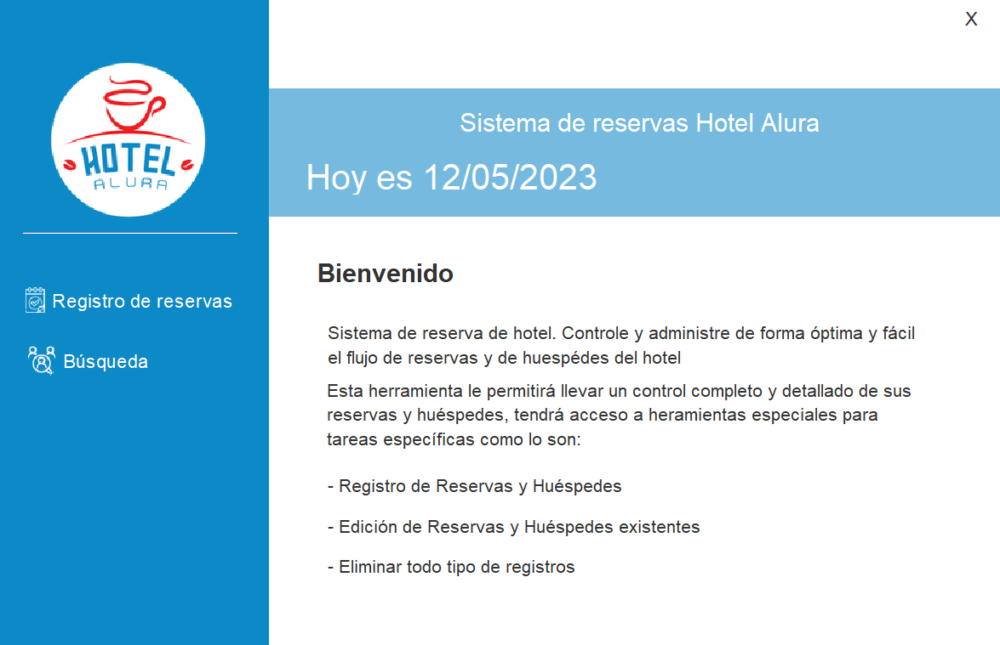

# Challenge ONE | Java | Back-end | Hotel Alura

     

---

## ⚒ Tecnologías Utilizadas:

- Java SE
- Java Swing
- Eclipse
- Biblioteca JCalendar
- Maven
- MySql
- JPA
- Hibernate
- Plugin WindowBuilder 
- Spring-Security-Core (org.springframework.security)
 

---
## ⚠️ Importante! ⚠️

☕ Use Java versión 11 o superior para compatibilidad.   
📠Use el editor de Eclipse para compatibilidad con la Interfaz Gráfica.   
🨠La interfaz contiene dos métodos importantes: 
- setResizable(false): determina el tamaño de la ventana, y a través del parámetro false, la pantalla no se puede maximizar;
- setLocationRelativeTo(null): determina la ubicación de la ventana, y a través del parámetro null la mantiene centrada en la pantalla. 

---

## 📂 Directorios 
🔹 src/main/java: Carpeta donde se guarda el codigo del proyecto. 
🔹 src/main/resources: Carpeta donde se encuentra el archivo de configuracion persistence.xml. 
🔹 imagenes: contiene las imagenes para este Readme.
---

## 📦 Paquetes /src/main/java:
🔹 com.josema.imagenes: contiene las imagenes para este proyecto. 
🔹 com.josema.views: contiene las interfaces graficas de Java Swing. 
🔹 com.josema.utils: contiene la clase JPAUtils que obtiene una instancia de EntityManager para interactuar con la BD. 
🔹 com.josema.modelo: contiene las entidades JPA que representan una tabla en la BD. 
🔹 com.josema.dao: contiene las consultas para obtener informacion de la BD. 
🔹 com.josema.controlador: contiene los controladores que encapsulan la logica de negocio y coordinan las operaciones de persistencia.

--- 
## 🖥️ Funcionamiento de la aplicacion
Login:
- Se pide el nombre de usuario y las contraseña.
- Se verifica si el usuario se encuentra registrado en la BD.
- Si no esta registrado, se mostrará un ventana indicando que no ha ingresado datos validos.
 

Menu Principal:
- Se muestra al usuario dos opciones (Registro de reservas & Busqueda)
 

Registro de Reserva:
- Se pide que ingrese la fecha de entrada, la fecha de salida, y la forma de pago.
- El valor de la reserva se calcular automaticamente
- Debe completar todos los campos, de lo contrario mostrará un mensaje y no se podra seguir con el registro.
- Al dar click en el boton siguiente mostrará la interfaz grafica para registrar al huesped.
 

Registro de Huesped:
- Se pide que ingrese el nombre, el apellido, la fecha de nacimiento, el dni, el telefono del huesped.
- El numero de la reserva del usuario se extrae de la reserva previamente registrada.
- Debe completar todos los campos, de lo contrario mostrara un mensaje y no resgistrará al huesped.
- Si el dni del huesped ya esta registrado anteriormente no lo agregara nuevamente, y seguira con el registro con normalidad.
- Al dar click al boton guardar mostrara una ventana mostrando que se guardo con exito y luego mostrará el menu principal.
 

Busqueda:

La interfaz grafica de busqueda, tiene dos ventanas (Reservas & Huespedes). Ambas tienen las mismas funciones:
- Boton de Busqueda: para ambos casos la busqueda se realiza por medio del DNI del huesped.
- Boton de Actualizar: actualizará los datos de la ventana en que se encuentre.
- Boton de Editar: abrira un nueva interfaz grafica dependiendo de la ventana en la que se encuentre y le permitirá editar el registro.
- Boton de Eliminar: elimina el registro que desee.
 

Nota: para editar o eliminar antes debes seleccionar el resgitro, de lo contrario mostrara un mensaje para que lo haga.

---

## 💾 Diagrama de la BD

     

---

# Menu Principal

     

---

# Login 

     

---

# Menu Usuario

     

---

# Registrar Reserva

     

---

# Registrar Huésped

     

# Búsqueda

     

---

## Contacto

## Licencia
MIT